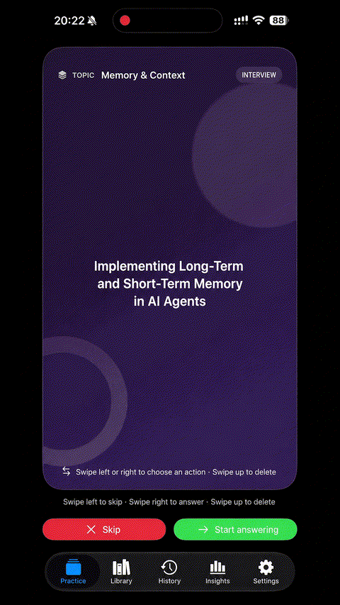

# Interview Flashcard

> [中文](README.md) | English

  

Interview Flashcard is an iPhone practice app for technical interview preparation. It turns scattered interview notes into a personal question bank that supports topic-based drills, direct answers, scored feedback, and progress tracking.

## What you can do

### Practice like a real interview

- Draw questions by topic and complete a continuous practice session.
- Swipe left to skip a question and right to answer it, or use the on-screen controls.
- Answer in text, or by voice when the device provides local speech transcription.
- When **Include practiced questions** is off, the app prioritizes questions without a submitted answer.

### Get evidence-based feedback

- After submitting an answer, review the refined answer, reference answer, and AI evaluation.
- Scores cover multiple dimensions so you can distinguish knowledge gaps, communication issues, and answer structure.
- Answer history preserves the original response, evaluation, and later improvements.
- When a question already has a reference answer, it is used for evaluation instead of being generated again.

### Manage your own question bank

- Organize questions by topic, search them, and inspect their source.
- See whether each question has already been practiced.
- Restore deleted questions from the trash instead of losing them permanently.
- Re-import the same source when your material changes or when you want another version of a collection.

### Build a question bank from interview material

- **Markdown import**: for unstructured interview notes. The app extracts questions, refines wording, categorizes them, and generates reference answers in the background. Import work can continue later.
- **JSON import**: for structured question files. The app validates questions, topics, and full-score answers without using AI to split or regenerate questions.
- Open or share `.md` and `.json` files from the Files app to Interview Flashcard.
- JSON imports show validation results and a question preview before the collection is written to the library.

### Track your practice trend

The Insights tab summarizes question-bank coverage, practiced and unpracticed questions, answer count, practice days, score trends, and topic-level progress. The History tab keeps every answer and evaluation in chronological order.

## Recommended workflow

1. Put interview-notes Markdown or structured JSON files in the Files app.
2. Choose **Open in Another App** or share them with Interview Flashcard.
3. Let Markdown imports be processed in the background; validate and confirm JSON imports.
4. Select a topic in the library and start answering in the Practice tab.
5. Use evaluations and history to revisit weaker topics.

## Good use cases

- Intensive technical interview preparation across several topics.
- Converting interview notes from websites or personal notebooks into one private question bank.
- Repeating a question category and comparing how answer quality changes over time.
- Importing a fixed set of questions with reference answers to keep evaluation standards consistent.

## Privacy and data

Questions, import records, answer history, and local recordings stay in the app's own data space. AI evaluation requires a configured AI service. Voice answers use device-provided local transcription whenever it is available.

## License

Licensed under the [Apache License 2.0](LICENSE).
