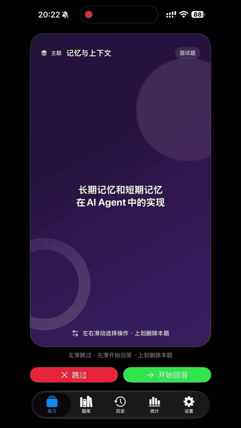

# 面试闪卡

  

面试闪卡是一款面向技术面试准备的 iPhone 练习工具。它把零散的面经资料整理成可持续复习的题库，让你按照主题抽题、直接作答，并通过评分记录看到自己的练习进展。

## 你可以用它做什么

### 像真实面试一样练习

- 从题库中按主题抽取题目，开始一轮连续练习。
- 左滑跳过当前题，右滑进入回答；也可以使用页面上的操作按钮。
- 支持文字回答，也支持在设备提供本地语音转写能力时用语音回答。
- 关闭“包含已练习题”后，默认优先练习还没有提交过回答的题目。

### 获得有依据的反馈

- 提交回答后，可以查看整理后的回答、参考答案和 AI 评分。
- 评分会从多个能力维度给出结果，帮助你区分知识缺口、表达问题和回答结构问题。
- 每次回答都会保留在历史中，方便回看原始回答、评分结果和后续改进。
- 题目已有参考答案时，评分直接使用已有答案，不重复生成。

### 管理自己的题库

- 按 Topic 组织题目，支持搜索和查看题目来源。
- 题库会显示题目是否已经练习过，方便快速找到待复习内容。
- 删除的题目会进入可恢复的回收站，避免误删后无法找回。
- 同一份资料可以再次导入，适合资料更新或建立不同版本的练习集。

### 从面经资料快速建立题库

- **Markdown 导入**：适合未经整理的面经文本。应用会在后台提取题目、整理表达、归类并生成参考答案，导入过程可以稍后继续。
- **JSON 导入**：适合已经结构化的题目文件。应用会直接校验题目、Topic 和满分答案，不再调用 AI 拆题或重复生成答案。
- 可以在“文件”App 中通过“用其他 App 打开”或分享，把 `.md`、`.json` 文件直接交给面试闪卡处理。
- JSON 导入前会先展示校验结果和题目预览，确认后再一次性写入题库。

### 看见自己的练习趋势

统计页会汇总题库覆盖率、已练习和未练习题目、回答次数、练习天数、分数趋势，以及不同 Topic 的练习情况。历史页则按时间保留每一次回答和评分记录。

## 推荐使用流程

1. 把面经 Markdown 或结构化 JSON 文件放到“文件”App。
2. 选择“用其他 App 打开”或分享至“面试闪卡”。
3. Markdown 文件进入后台整理；JSON 文件先校验和预览，再确认导入。
4. 在“题库”中选择 Topic，在“练习”页开始回答。
5. 根据评分和历史记录，回到薄弱 Topic 反复练习。

## 适合的使用场景

- 面试前集中刷题，快速覆盖多个技术主题。
- 把小红书、网页或笔记中的面经统一整理成个人题库。
- 反复练习同一类问题，比较不同回答的质量变化。
- 用已有满分答案导入一套固定题库，保持评分标准稳定。

## 隐私与数据

题目、导入记录、回答历史和本地录音保存在 App 自己的数据空间中。AI 评分需要在设置中配置可用的 AI 服务；语音回答优先使用设备提供的本地转写能力。

## 许可证

本项目采用 [Apache License 2.0](LICENSE) 开源。
